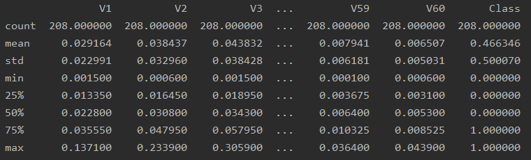
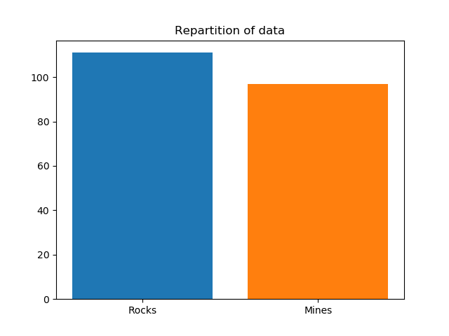
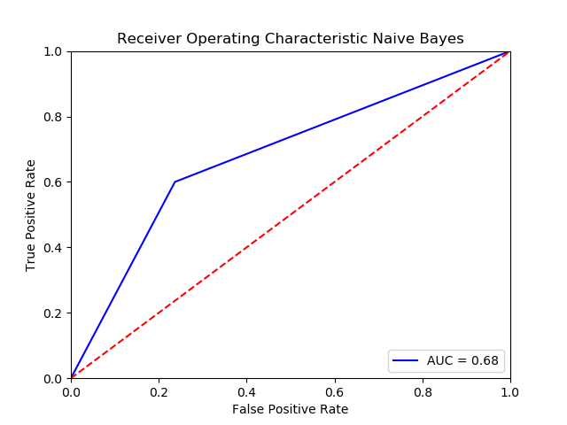
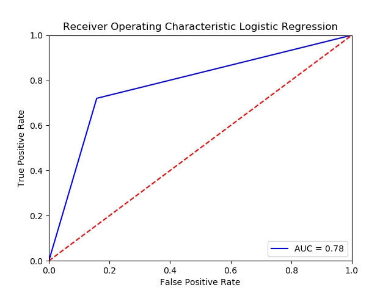
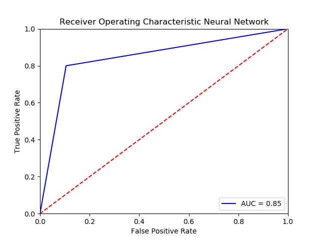

# Econometrics:

Application of different methods to predict mines on the following dataset:

https://archive.ics.uci.edu/ml/datasets/Connectionist+Bench+(Sonar,+Mines+vs.+Rocks)

**Requirements:**

The program is written and tested with Python 3.6.8 and needs the following libraries to work:

* [Python 3.6.X](https://www.python.org/downloads/release/python-368/)
* [Tensorflow](https://www.tensorflow.org/install)
* [Keras](https://keras.io/#installation)
* [Pandas](https://pandas.pydata.org/)
* [Scikit-learn](https://scikit-learn.org/stable/install.html)
* [Matplotlib](https://matplotlib.org/users/installing.html)

**Dataset Information:**

The transmitted sonar signal is a frequency-modulated chirp, rising in frequency. The data set contains signals obtained from a variety of different aspect angles, spanning 90 degrees for the cylinder and 180 degrees for the rock.

Each pattern is a set of 60 numbers in the range 0.0 to 1.0. Each number represents the energy within a particular frequency band, integrated over a certain period of time. The integration aperture for higher frequencies occur later in time, since these frequencies are transmitted later during the chirp.

Summary of the dataset:



We can see that the dataset is composed of 208 lines. Furthermore in the <code>Class</code> column we can see that the <code>mean</code> is about **46.6%** so we can assume that the dataset is **balanced** but with more rocks *(0)* than mines *(1)*.


If we look in details we get the following results:

* **97** mines :bomb:
* **111** rocks :moyai:




<br>

We open the dataset from the csv file with Pandas, we drop the <code>Class</code> column and we split the dataset as following: **70%** for the training part and **30%** for the testing part. <br>
We split **randomly** because if we look at the csv file we can see that we have all the mines at first and after all the rocks.
<br>
```python
# We get the data from the csv file
def prepare_dataset(path_csv):
    messages = pd.read_csv(path_csv, sep=';', encoding='latin-1')
    return messages

# Split dataset
def split_dataset(dataset):
    dataset_features = dataset.drop(['Class'], axis=1)
    print(dataset_features)
    return train_test_split(dataset_features, dataset['Class'], test_size=0.3, random_state=20)
```

### Metrics

*Precision: true positives / (true positives + false positvises), it corresponds to "What proportion of positive identifications was actually correct?"* <br>
*Recall: true positives / (true positives + false negatives), it corresonds to "What proportion of actual positives was identified correctly?"* <br>
*Accuracy: (true positives + true negatives) / Total, it's the fraction of predictions our model got right.* <br>
*Receiver Operating Characteristic (ROC): is a graphical plot that illustrates the diagnostic ability of a binary classifier system*<br>

### 1. Naive Bayes classifier

```python
# Naive Bayes classifier
def naiveBayesMethod(features_train, features_test, mines_train):
    classifier = MultinomialNB()
    classifier.fit(features_train, mines_train)
    return classifier.predict(features_test)
```
<br>
Confusion matrix:
<br>
<br>

|       |     Predicted negative     |   Predicted positive   |
| :------------: | :-------------: | :-------------: |
|  **Acutal negative**	   |    29   | 9  |
| **Actual positive**    |     10   | 15 |


<br>


Precision: 15/(15+9) = **62.5%**<br>
Recall: 15/(15+10) = **60%**<br>
Accuracy: (29+15)/(29+9+10+15) = **69.8%**<br>
ROC: **68.1%**



### 2. Logistic Regression

The Logistic Regression is a good method when the result is a binary classification such as in our case.

```python
# Logistic Regression Method
def logistic_regression(features_train, features_test, mines_train):
    mines_model = LogisticRegression(solver='lbfgs', max_iter=200)
    mines_model.fit(features_train, mines_train)
    return mines_model.predict(features_test)
```
<br>
Confusion matrix:
<br>
<br>

|       |     Predicted negative     |   Predicted positive   |
| :------------: | :-------------: | :-------------: |
|  **Acutal negative**	   |    32   | 6 |
| **Actual positive**    |     7   | 18 |


<br>

Precision: 18/(18+6) = **75%**<br>
Recall: 18/(18+7) = **72%**<br>
Accuracy: (32+18)/(32+6+7+18) = **78.1%**<br>ROC: **78.1%**




### 3. Neural Network

To make this neural netowrk I used Keras which is a neural networks API written in Python.

```python
def neuralNetwork(features_train, features_test, mines_train):
    classifier = Sequential()

    classifier.add(Dense(300, activation='relu', kernel_initializer='random_normal', input_dim=60))
    classifier.add(Dense(300, activation='relu', kernel_initializer='random_normal')) # Hidden layer
    classifier.add(Dense(300, activation='relu', kernel_initializer='random_normal')) # Hidden layer
    classifier.add(Dense(1, activation='sigmoid', kernel_initializer='random_normal')) # Output Layer

    classifier.compile(optimizer='adam', loss='binary_crossentropy', metrics=['accuracy'])

    classifier.fit(features_train, mines_train, batch_size=32, epochs=300)

    y_pred = classifier.predict(features_test)
    y_pred = (y_pred > 0.5)
    return y_pred
```
<br>
Confusion matrix:
<br>
<br>

|       |     Predicted negative     |   Predicted positive   |
| :------------: | :-------------: | :-------------: |
|  **Acutal negative**	   |    34  | 4 |
| **Actual positive**    |     7   | 18 |


<br>

Precision: 18/(18+4) = **81.8%**<br>
Recall: 18/(18+7) = **72%**<br>
Accuracy: (34+18)/(34+4+7+18) = **80.7%**<br>
ROC: **84.7%**



<br> 

### 4. Conclusion

If we look at the results obviously the Neural Network is the best solution, the Logistic Regression comes after and finally the Naive Bayes Classifier. <br>

I could obtain better results if I took the time to look in details for the parameters of each methods but for the Neural Network and the Logistic Regression there are not so bad. <br>

I could also look for other methods such as [Random Forest](https://en.wikipedia.org/wiki/Random_forest) which could be a good method for this case.